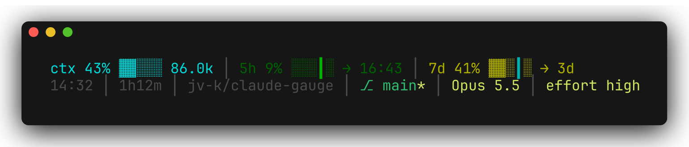

# claude-gauge



Two small bars for [Claude Code](https://code.claude.com) that show how much room you have left: in the context window, in your 5-hour usage window, and in your weekly limit.

Install it as a Claude Code plugin or from npm (see [Install](#install)). To switch from claude-hud, see [Coming from claude-hud](#coming-from-claude-hud).

**Status line**, shown under the prompt in the terminal, in two rows by default:

```text
ctx 43% ▓▓░░░ 86.0k │ 5h 9% ░░┃░░ → 14:10 │ 7d 41% ▓▓░┃░ → 3d
11:10 │ 1h12m │ jv-k/claude-gauge │ ⎇ main* ↑1 │ Opus 5.5 │ effort high
```

**Token line**, shown when each turn ends:

```text
12:10 │ 4 req │ out 3.4k (1.2k think) │ cache w6.5k r1.69M │ ctx 43% ▓▓░░░ 427k
```

Both are TypeScript modules built to single Node.js files with no dependencies, and both use the same parts: `│` between segments, short lowercase labels, and `▓░` bars. Switches choose what each line shows and how (see [Options](#options)). For example, `--show 5h,7d --segments 10` gives a status line with only your usage, in 10-cell bars:

```text
5h 9% ▓░░░┃░░░░░ → 14:10 │ 7d 41% ▓▓▓▓░░┃░░░ → 3d
```

The terminal CLI shows both bars by itself. In the VS Code extension and the desktop app, Claude can paste them into its replies instead (see [In VS Code and the desktop app](#in-vs-code-and-the-desktop-app)).

Setup shows the status line with the defaults, and redraws it after each answer as you choose the rows, parts, bar size and theme:


## What the bars show

### Status line

The default rows hold these parts, in this order. The name in the first column is what `--show` takes.

| Part | Shows | Meaning |
| --- | --- | --- |
| `ctx` | `ctx 43% ▓▓░░░ 86.0k` | How much of the context window is in use, as a percentage, a bar and a token count, the same shape as the token line's `ctx`. Cyan up to 50%, yellow up to 75%, red above. |
| `5h` | `5h 9% ░░┃░░ → 14:10` | Your 5-hour usage, as a bar, and the time the window resets. |
| `7d` | `7d 41% ▓▓░┃░ → 3d` | Your weekly usage, and the days until it resets. On the day of the reset it shows the time instead. |
| `time` | `11:10` | The current local time, or `11:10 am` with `--12h`. |
| `duration` | `1h12m` | How long the session has run: `45s`, `12m`, `1h12m`, `2d3h`. |
| `repo` | `jv-k/claude-gauge` | The repository from the `origin` remote. Without one it shows the folder name. It links to the folder. See [Links](#links). |
| `branch` | `⎇ main* ↑1` | The current git branch. `*` follows it when the work tree has changes, untracked files included, and `↑n` and `↓n` show the commits it is ahead of and behind its upstream. Inside a linked worktree it names that too: `⎇ feat-x* (wt my-feature)`. On GitHub and GitLab it links to the branch's page. See [Links](#links). |
| `model` | `Opus 5.5` | The model. When requests do not go to the Anthropic API, the provider follows it: `Opus 5.5 (Bedrock)`. See **Provider** below. |
| `effort` | `effort high` | The reasoning effort, following `/effort` changes, when the model supports effort. |

**Context.** The percentage counts input only: fresh input, cache writes and cache reads. It does not count output. A high figure means that Claude Code will soon compact the conversation.

**Usage colours.** Each usage bar has 10 colour steps, from dark green at 0–10% to deep red above 90%. These colours, and the others on this page, are the `default` theme's. `--theme` picks another (see [Themes](#themes)).

**Pace marker.** The `┃` sits at the share of the window that has passed. If it is ahead of the filled cells, you are using less than an even pace. Its colour comes from the usage projected for the end of the window, calculated as used % × window length ÷ time elapsed:

| Projected usage | Colour |
| --- | --- |
| below 50% | green |
| 50% to 75% | teal |
| 75% to 90% | yellow |
| 90% to 100% | orange |
| 100% to 120% | red |
| above 120% | purple |

For the first 9 minutes of the 5-hour window, and for about the first 50 minutes of the week, the marker uses the bar's own colour, because the projection is not reliable that early.

**Git.** The `branch`, `git` and `files` parts share one `git status` call per render, made only when one of them is shown. If git takes more than a second, or prints more than a status line can use, `branch` shows the branch name alone, read from the repository's `HEAD` file without running git again, and `git` and `files` stay out of the row. Outside a git repository, and on a detached HEAD, `branch` stays out too.

**Reset times.** Reset times use the 24-hour clock and are rounded to the nearest minute.

**Provider.** The `model` part reads the provider from the variables that Claude Code sets, or that you set in your shell or in the `env` block of your settings: `Bedrock` for `CLAUDE_CODE_USE_BEDROCK` or `CLAUDE_CODE_USE_MANTLE`, `Vertex` for `CLAUDE_CODE_USE_VERTEX`, `Foundry` for `CLAUDE_CODE_USE_FOUNDRY`, `AWS` for `CLAUDE_CODE_USE_ANTHROPIC_AWS` (Claude Platform on AWS), and `Enterprise` when `ANTHROPIC_BASE_URL` names a host other than `api.anthropic.com`, such as a company gateway. A variable counts as set when it is `1`, `true`, `yes` or `on`. With none of them, the model shows alone.

**`~`.** A usage part shows `~`, as in `5h ~`, when Claude Code has not sent usage data yet. This happens before the first response of a session, and on plans that have no such limits. The usage parts need a claude.ai Pro or Max subscription.

### More status line parts

These parts show only when you name them in a `--show`. A part with nothing to report stays out of its row.

| Part | Shows | When |
| --- | --- | --- |
| `dir` | The folder Claude Code runs in: `my-project`. It links to the folder. See [Links](#links). | Always. |
| `cost` | The session's estimated cost at list price: `$1.23`. Behind a spend limit it takes that limit's usage colour. | Always. Resets on `/clear`. |
| `lines` | Lines of code added and removed this session: `+156 −23`. | Always. |
| `name` | The session's name, or its AI-generated title, cut to 30 characters with `…`. | When the session has one. |
| `thinking` | `think`, when extended thinking is on. | Only when on. |
| `fast` | `fast`, when fast mode is on. | Only when on. |
| `style` | The output style: `style explanatory`. | When it is not `default`. |
| `git` | The work tree's changes, as counts: `!2 +1 ✘1 ?3` for modified, staged, deleted and untracked files. A file staged and then changed or deleted again counts in both. An untracked folder counts once, as git lists it. | When the work tree has changes. |
| `files` | Up to 3 changed files, the most recently changed first: `statusline.ts README.md notes.txt`. A deleted file comes last, because it has no time. In a change set of more than 1000 files, it picks from the first 1000 that git lists. | When the work tree has changes. |
| `worktree` | The linked git worktree: `wt my-feature`. The `branch` part names it too: `⎇ feat-x (wt my-feature)`. | Inside a linked worktree. |
| `pr` | The branch's open pull request and its review state: `#1234 approved`. Green when approved, yellow when pending, red when changes are requested, grey as a draft. A GitLab merge request reads `!1234`. It links to the pull request. See [Links](#links). | While a PR is open. |
| `agent` | The agent: `agent security-reviewer`. | When Claude Code runs with `--agent`. |
| `cache` | The prompt cache's hit ratio and state: `cache 91% warm`. Green when most requests hit the cache, red when most miss. | After the session's first response. |
| `spend` | Your spend against the limit: `$314/$500`, or `spend 63%` until Claude Code has the dollar amounts. | Behind a Claude apps gateway with a spend limit. |
| `version` | The Claude Code version: `v2.1.90`. | Always. |
| `today` | What all your sessions have spent today, at list price: `today $4.12`. | Once a session has a cost, or the ledger has spend for today. |
| `week` | What all your sessions have spent this week, from Monday: `week $23.50`. | Once a session has a cost, or the ledger has spend for this week. |
| `tools` | The tool running now and what it works on, then the five tools used most this session, with counts: `◐ Edit src/a.ts ✓ Read ×12 ✓ Bash ×3`. A file inside the project shows relative to it, and a target longer than 30 characters is cut with `…`. Subagents' tools are not counted. | Once the session has called a tool. |
| `agents` | The subagents running now, then those that finished in the last minute, up to three, each with its type, model, description and the time it has run: `◐ Explore (Haiku 4.5) Map the reader 1m ✓ Plan (Sonnet 4.5) Plan the change 3m`. A subagent that failed or was stopped shows `✗`. The model shows once the transcript names it: at once when the call picks a model or the subagent runs in the background, else when it finishes. A description longer than 30 characters is cut with `…`. This is not the `agent` part, which names the agent Claude Code runs as. | While a subagent runs, and for a minute after it finishes. |
| `todos` | The todo Claude is working on, then how many of the session's todos are done: `◐ Writing the tests 2/5`. It reads the list Claude keeps with TodoWrite, or with the task tools (TaskCreate and TaskUpdate). With no todo in progress it shows the count alone, `todos 2/5`, with `✓` once all are done. A todo longer than 30 characters is cut with `…`. It counts only what this session writes to its todos and tasks. A change that a subagent or another session makes does not show. | Once the session has todos. |
| `skills` | The skills the session used, newest first, then the MCP servers it called: `skills tdd code-review mcp ✗ linear github`. A skill counts when Claude runs it with the Skill tool, or when you run it as a slash command; a built-in command such as `/clear` is not a skill. A server shows from its first call, by the name its tools carry (`mcp__github__search_issues` is `github`). A server whose latest call failed shows first, in red with `✗`, until a call to it works. A call that you reject or interrupt, or that a permission rule denies, does not count either way. It shows three skills and three servers, and every server marked `✗`. A name longer than 30 characters is cut with `…`. Subagents' skills and calls are not counted. To count the MCP servers set up rather than called, see `env`. | Once the session has used a skill or called an MCP server. |
| `compactions` | How many times the conversation has been compacted, by you with `/compact` or by Claude Code when the context fills: `compactions 2`. Many compactions in one session mean that it has lost detail from its early work. | After the first compaction. |
| `reply` | The time since Claude last replied: `reply 3m ago`. It counts from the last block of Claude's last response. Subagents' replies, and the error messages Claude Code writes in place of a reply, do not count. | After Claude's first reply. |
| `speed` | The output speed of Claude's last response, in tokens per second: `84 tok/s`, or `6.3 tok/s` below ten. It counts the response's output tokens over the time from the prompt or tool result that asked for it to the response's last block, so the wait for the first token counts too. | After a response with output tokens. |
| `env` | What Claude Code loads into the session: `env 2 md 4 rules 3 mcp 2 hooks`, for CLAUDE.md files, rules, MCP servers and hooks. A kind with none stays out. See [Environment and plan](#environment-and-plan). | When anything is loaded. |
| `plan` | Your claude.ai plan and the account you are signed in with: `Claude Max 20x (me@example.com)`. | When the config names them. |
| `models` | Your weekly usage for each model with a weekly limit of its own, shown as `7d` shows the week, with the model's name: `7d Opus 41% ▓▓░┃░ → 3d`. Several models show as several segments, sorted by their window's name in Claude Code's input. `--no-labels` drops `7d` and keeps the name. See [Per-model windows](#per-model-windows). | When Claude Code sends per-model weekly windows. |
| `limit` | A notice naming each window at 100%, with its reset: `limit reached: 5h → 14:10`, or `limit reached: 7d → 3d, 7d Opus → 3d` for more than one. It covers `5h`, `7d`, each per-model window and the spend limit. The 5-hour reset shows as a time, and the others as days, or as a time on the day of the reset. `--no-reset` drops the resets, and the window names stay with `--no-labels`. In deep red. | While a window is at 100%. |
| `ram` | The system's memory in use, as a percentage, a bar and the amount in gigabytes: `ram 66% ▓▓▓░░ 10.5G`. It takes the usage colours. See [Memory, text and command](#memory-text-and-command). | Always. |
| `text` | Fixed text that you give with `--text`, such as a label for the machine: `work laptop`. | With `--text`. |
| `command` | The first line of output of a shell command that you give with `--command`: `prod-eu`. See [Memory, text and command](#memory-text-and-command) for the rules it runs under. | With `--command`, when the command succeeds in time. |

**Cost ledger.** `today` and `week` add up the spend of every session, from a ledger that each terminal render keeps in `~/.claude/claude-gauge/.state/ledger.json` (under `$CLAUDE_CONFIG_DIR` when that is set). A render records what its session has spent since the session was last recorded, against the local day of that render, so a session that runs past midnight counts on both days. Each session writes to the ledger at most once every 10 seconds; the parts always include the current session's latest cost, so they never fall behind in the session you are in. Spend a session makes in its last 10 seconds is recorded when it next renders, so a session that ends then leaves that spend out. Several sessions can render at once without harm: a write locks the ledger and replaces the file whole. The ledger keeps 31 days.

**Transcript parts.** `tools`, `agents`, `todos`, `skills`, `compactions`, `reply` and `speed` read the session transcript. claude-gauge reads it only when a `--show` names such a part, and then reads only the lines added since the last render. It keeps its place in each transcript in `~/.claude/claude-gauge/.state/transcripts/`, or under `$CLAUDE_CONFIG_DIR` when that is set. A transcript that shrinks or is replaced is read again from the start.

#### Per-model windows

Claude Code's documented status line input has the 5-hour, weekly and spend windows. Some plans also have a weekly limit for one model, such as Opus, and Anthropic's usage figures name that window `seven_day_opus`. When Claude Code sends a window named `seven_day_<model>` in its `rate_limits`, `models` shows it and `limit` watches it. The name after `7d` is the part after `seven_day_`, capitalised, with underscores as spaces, so a new model needs no new release. A name can hold letters, digits, underscores, dots and hyphens. A window whose name holds anything else stays out. A window with no percentage stays out. Until Claude Code sends such a window, `models` shows nothing and stays out of its row.

#### Environment and plan

`env` and `plan` read the files Claude Code reads, on your machine, with no network call. The config folder is `~/.claude`, or `CLAUDE_CONFIG_DIR` when you set it.

- **CLAUDE.md files**: the user's `CLAUDE.md` in the config folder, the managed one an administrator installs, and `CLAUDE.md`, `.claude/CLAUDE.md` and `CLAUDE.local.md` in the folder Claude Code runs in and every folder above it. Files in subfolders load only when Claude works there, so they do not count.
- **Rules**: every `.md` file, at any depth, under `rules/` in the config folder and under `.claude/rules/` in the folder Claude Code runs in and every folder above it.
- **MCP servers**: the user and local servers in `.claude.json`, the project's `.mcp.json`, and the managed `managed-mcp.json`, each name once. Project servers that a settings file turns off with `disabledMcpjsonServers` do not count.
- **Hooks**: one per hook command in the user, project, local and managed settings files.
- **Plan**: the subscription in `.credentials.json` in the config folder: `max` on the 20x tier is `Claude Max 20x`, `pro` is `Claude Pro`. Only the plan fields are read from that file. Where that file does not exist, as on macOS, where Claude Code keeps the login in the Keychain, the plan comes from the account in `.claude.json` instead. claude-gauge never reads the Keychain.
- **Account**: the email address of the signed-in account, from `.claude.json`.

Plugin hooks and MCP servers are not counted.

#### Memory, text and command

`ram` reads the memory that each system's own monitor reports as in use, with no network call:

- **macOS**: app memory, wired memory and compressed memory, from `vm_stat`. Activity Monitor shows the same sum as Memory Used.
- **Linux**: the total less `MemAvailable`, from `/proc/meminfo`. Memory that the kernel uses as a cache and gives back on demand does not count as used.
- **Windows**: the total less the available memory, as Node.js reports them.

If the system figures cannot be read, `ram` uses the free and total memory that Node.js reports.

`text` shows the value of `--text` as you give it. claude-gauge removes any terminal control codes from it first.

`command` runs a shell command that you choose. These rules keep it safe and keep the status line fast:

- **It runs only when you ask twice.** `--command` must name a command, and a `--show` row must name the `command` part. Without both, nothing runs.
- **It runs as you wrote it.** claude-gauge passes the command to the system shell (`sh` on macOS and Linux, `cmd.exe` on Windows) with your permissions, in the folder Claude Code runs in, with no input. Claude Code renders the status line often, so use a quick command that only reads.
- **It has 500 ms.** After 500 ms, claude-gauge stops the command and the part shows nothing. A slow or hung command delays the status line by 500 ms at most. On macOS and Linux, claude-gauge also stops any job that the command started in the background, when the command ends or runs out of time. On Windows, such a job can keep running.
- **It shows one clean line.** The part shows the first line of output that has text in it. claude-gauge removes terminal control codes from that line, so the output cannot move the cursor, change colours or set the window title. Error output is discarded.
- **It fails quietly.** When the command exits with an error, runs out of time, or prints more than 64 KB, the part shows nothing and the other parts show as usual.

#### Links

In a terminal that supports OSC 8 hyperlinks, such as iTerm2, kitty or WezTerm, four parts are links that you can click:

- **`dir` and `repo`** link to the folder Claude Code runs in. The address is a `file://` address with the machine's name in it, so that the terminal can tell a folder on another machine from a local one.
- **`branch`** links to the branch's page on GitHub or GitLab. The link shows only when the `origin` remote is on `github.com` or `gitlab.com` and the branch has an upstream on `origin`, because a branch without one may not be on the remote. The link goes to the upstream branch, which can have a different name from the local branch.
- **`pr`** links to the pull request, at the web address that Claude Code gives.

A part shows no link when its address is not known, for example a `branch` on another host. A terminal without OSC 8 support shows the text only. If your terminal shows the link codes as text, turn the links off with `--no-links`. `--latest` never prints links, because its rows are pasted into a reply as plain text.

### Token line

| Part | Meaning |
| --- | --- |
| `12:10` | The local time the turn ended. |
| `4 req` | API requests made since your last prompt, subagents included. |
| `out 3.4k (1.2k think)` | Output tokens, and how many of them were thinking. |
| `cache w6.5k r1.69M` | Prompt-cache writes and reads. |
| `ctx 43% ▓▓░░░ 427k` | The context the last request carried, as a share of the window and as a bar. |

**Requests.** One request is one model call, so each tool round trip counts as one request. With `--latest`, the count leaves out the request that writes the final reply, because that request is still running. As a Stop hook, the count includes every request.

**Thinking.** Thinking tokens are part of the output figure. They are not added to it.

**Cache.** Cache writes (`w`) are new content stored for reuse, and they cost a little more than plain input. Cache reads (`r`) come to about the number of requests × the context size, so they can reach millions. Reads are cheap, so a large `r` is normal.

**Fresh input.** Uncached input counts toward `ctx` but is not shown on its own, because it is usually tiny.

**Context.** The `ctx` figure should match the status line's context percentage, when the token line uses the right window size (see [Token line options](#token-line-options)).

## Requirements

- Claude Code
- Node.js 18 or later, with npm for the npm route

## Install

### As a Claude Code plugin

In Claude Code, add this repository as a plugin marketplace, install the plugin, and run its setup:

```text
/plugin marketplace add jv-k/claude-gauge
/plugin install claude-gauge@claude-gauge
/claude-gauge:setup
```

Start a new session or run `/reload-plugins` after the install, so the setup command is there. Setup asks which bars you want, and whether to keep the defaults or choose the rows, bar size, theme and token line parts. It then runs `claude-gauge setup` with your answers as switches, which backs up `~/.claude/settings.json` and adds the bars to it. A plugin cannot set the status line itself, which is why setup writes your settings.

The plugin has three commands:

| Command | Effect |
| --- | --- |
| `/claude-gauge:setup` | Adds the status line and the token line. If your settings already run another status line, such as claude-hud, it asks before it replaces it, and saves it. |
| `/claude-gauge:configure` | Changes the switches of a bar, adds the missing one, or takes one out. |
| `/claude-gauge:uninstall` | Takes claude-gauge out of your settings and puts back the status line it replaced. |

The settings run a small launcher in `~/.claude/claude-gauge/launcher/`, not the plugin's own folder. Claude Code keeps each plugin version in a folder of its own, so the launcher runs the newest installed version each time. A plugin update therefore needs no setup, and once the plugin is uninstalled the launcher prints nothing.

### From npm

In a terminal, run setup with npx:

```sh
npx claude-gauge setup
```

Setup shows the status line with the defaults, and asks whether to keep them. If you do not, it asks for the rows and their parts, the bar size, the theme and the labels, and then whether to add the token line. It redraws the status line after each answer, from your last terminal session's figures or from a sample. It then backs up `~/.claude/settings.json` and adds the bars to it. If your settings already run another status line, such as claude-hud, setup shows it and asks before it replaces it, and saves it so that `uninstall` can put it back. With the GitHub CLI (`gh`) installed, setup ends with an offer to star the repository. The default answer is no.

Setup copies the two scripts into `~/.claude/claude-gauge/runtime/` (under `$CLAUDE_CONFIG_DIR` when that is set) and points the settings there, so the bars keep working when npm clears its npx cache. To keep the `claude-gauge` command at hand instead of running it through npx, install it globally with `npm install -g claude-gauge`.

The `claude-gauge` command has four commands:

| Command | Effect |
| --- | --- |
| `claude-gauge setup` | Adds the status line and the token line. |
| `claude-gauge configure` | Changes the switches of a bar that setup added, adds the missing one, or takes one out. |
| `claude-gauge uninstall` | Takes claude-gauge out of your settings and puts back the status line it replaced. |
| `claude-gauge update` | Copies the scripts of the version you run into `~/.claude/claude-gauge/runtime/`, and keeps your switches. |

`setup` and `configure` ask their questions when you give them no bar switches. With bar switches they ask nothing, which suits scripts and dotfiles:

| Switch | Effect |
| --- | --- |
| `--status-line <switches>` | Adds the status line, run with these switches. `""` gives the defaults. |
| `--no-status-line` | Leaves the status line out, or takes it out. |
| `--token-line <switches>` | Adds the token line, run with these switches. `""` gives the defaults. |
| `--no-token-line` | Leaves the token line out, or takes it out. |
| `--replace` | Replaces a status line that is not claude-gauge's. Without it, a command with bar switches stops rather than replace it. |
| `--yes` | With `setup` only: adds each bar that the switches above do not name, with the defaults. |

For example, both bars with the defaults, and then 10-cell bars on the status line:

```sh
npx claude-gauge setup --yes
npx claude-gauge configure --status-line "--segments 10"
```

The settings file is `~/.claude/settings.json`, or `$CLAUDE_CONFIG_DIR/settings.json` when that variable is set. `claude-gauge --help` lists the commands and switches. The bars' own switches are in [Options](#options).

### With Claude Code

Paste this into a Claude Code session:

```text
Install claude-gauge: clone https://github.com/jv-k/claude-gauge to ~/.claude/claude-gauge, then follow INSTALL-WITH-CLAUDE.md in it.
```

Claude asks which bars and parts you want, checks that they run, backs up your settings and merges the new entries into them. If you also use the VS Code extension or the desktop app, it adds the hooks that paste the bars into its replies there. To update later, ask the same again.

### By hand

Clone the repo into your Claude Code folder:

```sh
git clone https://github.com/jv-k/claude-gauge.git ~/.claude/claude-gauge
```

Then add one or both bars to `~/.claude/settings.json`. If the file already has a `hooks` block, add the `Stop` entry to it rather than replacing it.

**Status line:**

```json
{
  "statusLine": {
    "type": "command",
    "command": "node ~/.claude/claude-gauge/dist/statusline.js"
  }
}
```

**Token line**, as a hook that runs when each turn ends:

```json
{
  "hooks": {
    "Stop": [
      {
        "hooks": [
          { "type": "command", "command": "node ~/.claude/claude-gauge/dist/tokenline.js" }
        ]
      }
    ]
  }
}
```

Start a new Claude Code session to pick up the changes.

To install without git, download the two built files instead:

```sh
mkdir -p ~/.claude/claude-gauge/dist
curl -fsSL https://raw.githubusercontent.com/jv-k/claude-gauge/main/dist/statusline.js -o ~/.claude/claude-gauge/dist/statusline.js
curl -fsSL https://raw.githubusercontent.com/jv-k/claude-gauge/main/dist/tokenline.js -o ~/.claude/claude-gauge/dist/tokenline.js
```

### In VS Code and the desktop app

Claude Code runs a custom status line and shows Stop hook messages only in the terminal CLI. At the time of writing, the VS Code extension and the desktop app show neither. You can still see both bars there in two ways:

- **Run `claude` in VS Code's integrated terminal.** That is the terminal CLI, so both bars show as usual.
- **Have Claude paste the bars into its replies.** A SessionStart hook asks it to, in those two hosts only.

For the second way, keep the settings entries above and add one hook per bar you want in the replies:

```json
"hooks": {
  "SessionStart": [
    { "hooks": [ { "type": "command", "command": "node ~/.claude/claude-gauge/dist/statusline.js --instruct" } ] },
    { "hooks": [ { "type": "command", "command": "node ~/.claude/claude-gauge/dist/tokenline.js --instruct" } ] }
  ]
}
```

`--instruct` reads the host from the `CLAUDE_CODE_ENTRYPOINT` variable, which Claude Code sets and its hooks inherit. In the VS Code extension (`claude-vscode`) and the desktop app (`claude-desktop`, `claude-desktop-3p`) it prints an instruction into Claude's context: end every reply with the output of the same command with `--latest` in place of `--instruct`, run as the last tool call of the turn and pasted verbatim in one code block, never guessed and never reused from an earlier turn. In the terminal CLI (`cli`) it prints nothing. One settings file therefore serves every host, and the terminal, which shows the bars already, stays as it is. Any other or missing value also prints nothing: the variable is not documented, so a host under a new name gets a quiet session rather than a wrong one. `echo $CLAUDE_CODE_ENTRYPOINT` in Claude's shell shows the value.

The hook runs when a session starts, resumes, is cleared with `/clear`, or compacts, so the instruction survives all four. The reply in the VS Code panel then ends like this:

```text
ctx 43% ▓▓░░░ 86.0k │ 5h 9% ░░┃░░ → 14:10 │ 7d 41% ▓▓░┃░ → 3d
11:10 │ 1h12m │ jv-k/claude-gauge │ ⎇ main* ↑1 │ Opus 5.5 │ effort high
12:10 │ 4 req │ out 3.4k (1.2k think) │ cache w6.5k r1.69M │ ctx 43% ▓▓░░░ 427k
```

Each hook takes its bar's usual switches, such as `--show` and `--segments`, and passes them on to the command it names. On a 1M-context model, add `--window 1m` to both, for the reason in [Token line options](#token-line-options). Each reply costs one or two short tool calls more.

`--latest` finds the calling session by the `CLAUDE_CODE_SESSION_ID` variable, which Claude Code sets for the commands it runs. Without that variable, it takes the newest transcript of the current folder. It prints no colours, because a reply shows colour codes as junk.

**What the status line can rebuild.** A transcript holds less than the input Claude Code sends a status line, so with `--latest`:

- `ctx`, `model` and `effort` come from the session's last response. `duration` counts from the first entry in the transcript.
- `time`, `dir`, `repo`, `branch` and `worktree` come from the clock and from git, as in the terminal.
- `env` and `plan` come from the files on disk, and the provider after `model` from the environment, as in the terminal.
- `5h`, `7d`, `models` and `limit` come from the last time the status line ran in a terminal, in any session. Claude Code sends usage figures only to a status line, so each terminal render saves them in `~/.claude/claude-gauge/.state/usage.json`, per-model windows included. The figures are as recent as that render. Until a terminal render saves them, and after a window resets, `5h` and `7d` show `~`, and `models` and `limit` leave that window out.
- `today` and `week` come from the cost ledger that terminal renders keep. The figures are as recent as the last terminal render of each session.
- The other parts, such as `cost`, `lines`, `pr` and `cache`, have nothing to report, and stay out of their row.

## Options

Both scripts take switches on the command line, so you set them in the `command` of your settings and never edit the scripts. A switch takes its value after a space or an `=`: `--show 5h,7d` and `--show=5h,7d` are the same.

### Status line options

| Switch | Effect |
| --- | --- |
| `--show <parts>` | One row: the parts to show, in the order given, separated by commas. Parts: those in [Status line](#status-line) and [More status line parts](#more-status-line-parts). Repeat `--show` for more rows. Default: two rows, `ctx,5h,7d` and `time,duration,repo,branch,model,effort`. |
| `--segments <5\|10>` | Cells per bar. Default: 5. Any other value gives 5. |
| `--no-labels` | Drops the labels in front of values, such as `ctx`, `5h`, `7d` and `effort`. |
| `--no-bars` | Drops the bars, and with them the pace markers. |
| `--no-pace` | Drops the pace markers. |
| `--no-reset` | Drops the reset times. |
| `--12h` | Shows the `time` part and reset times on the 12-hour clock. Default: 24-hour. |
| `--compact` | Fits narrow terminals: `│` between parts with no spaces round it, and shorter labels: `c` for `ctx`, `eff` for `effort`, `sty` for `style`, `agt` for `agent`, `cch` for `cache`, `spd` for `spend`, `tdy` for `today`, `wk` for `week` and `cmp` for `compactions`. The other labels are short already. |
| `--no-links` | Drops the links on `dir`, `repo`, `branch` and `pr`. See [Links](#links). |
| `--right <parts>` | The parts to right-align, separated by commas. In each row that shows any of them, they move to the end of the row, in the row's order, and spaces fill the gap so the row ends at the terminal's right edge. Claude Code gives the terminal width in `COLUMNS`. When the width is unknown, as with `--latest`, the row is too long to leave a gap, or the row holds characters whose width varies by terminal, such as CJK text and emoji, the row is left as it is. Repeat `--right` to name more parts. |
| `--text <text>` | The text that the `text` part shows. Quote text that holds spaces: `--text 'work laptop'`. If you give `--text` more than once, the last one counts. |
| `--command <command>` | The shell command that the `command` part runs. Quote the command as one value: `--command 'kubectl config current-context'`. It runs only when a `--show` row names `command`. See [Memory, text and command](#memory-text-and-command) for its rules. |
| `--theme <name>` | The colour preset: `default`, `mono`, `high-contrast` or `pastel`. An unknown name gives `default`. See [Themes](#themes). |
| `--color <part>=<colour>` | One part's colour, over the theme's: a name such as `red` or `bright-red`, a 256-colour number from `0` to `255`, or a hex colour such as `#ff8800` or `#f80`. Separate more parts with commas, or repeat the switch. See [Colours and bar characters](#colours-and-bar-characters). |
| `--bar-filled <char>` | The character of a filled bar cell. Default: `▓`. |
| `--bar-empty <char>` | The character of an empty bar cell. Default: `░`. |
| `--latest` | Prints the rows for the calling session from its transcript, as plain text, instead of reading Claude Code's input. See [In VS Code and the desktop app](#in-vs-code-and-the-desktop-app). |
| `--window <size>` | With `--latest`: the context window size, for example `200k` or `1m`, as for the token line. |
| `--instruct` | As a SessionStart hook: in the VS Code extension and the desktop app, prints an instruction that has Claude end each reply with the `--latest` rows; in the terminal CLI, prints nothing. The other switches pass through to the command it names. See [In VS Code and the desktop app](#in-vs-code-and-the-desktop-app). |

A row with nothing to show is left out, and a `--show` that names no known part adds no row.

#### Themes

`--theme` restyles every part at once. The name in the first column is what `--theme` takes.

| Theme | Colours |
| --- | --- |
| `default` | Usage from dark green to deep red, context in cyan, yellow and red, details in grey. |
| `mono` | No colour: every part in the terminal's own text colour. |
| `high-contrast` | The terminal's bright colours, with details in white rather than grey, for dim screens and low vision. |
| `pastel` | Soft 256-colour tones, on the same green-to-red usage scale. |

The pace marker keeps its six steps in every theme but `mono`, where only its position shows the pace.

#### Colours and bar characters

`--color` sets one part to one colour, on top of the theme. The whole part takes that colour, except the pace marker, whose colour is what it reports. The `│` separators keep the theme's colour. The colour names are `black`, `red`, `green`, `yellow`, `blue`, `magenta`, `cyan` and `white`, each also as `bright-red` and so on, and `gray` or `grey`. A hex colour needs a terminal with 24-bit colour. An unknown part or colour is ignored.

`--bar-filled` and `--bar-empty` each take one character, and every bar uses it, the `ctx` bar and the usage bars alike. More than one character, or a control character, is ignored. A wide character, such as an emoji, makes the bar wider.

#### Examples

Put the switches after the script in the `command` of your settings, for example `"command": "node ~/.claude/claude-gauge/dist/statusline.js --show 5h,7d"`.

Only your usage, on one row:

```text
--show 5h,7d

5h 9% ░░┃░░ → 14:10 │ 7d 41% ▓▓░┃░ → 3d
```

Usage and context in 10-cell bars, without pace markers:

```text
--show ctx,5h,7d --segments 10 --no-pace

ctx 43% ▓▓▓▓░░░░░░ 86.0k │ 5h 9% ▓░░░░░░░░░ → 14:10 │ 7d 41% ▓▓▓▓░░░░░░ → 3d
```

As short as it gets: no labels, no bars, the 12-hour clock:

```text
--show ctx,5h,7d,model --no-labels --no-bars --12h

43% 86.0k │ 9% → 02:10 pm │ 41% → 3d │ Opus 5.5
```

Narrow terminals, with `--compact`:

```text
--show ctx,5h,7d --show repo,branch,model,effort --compact

c 43% ▓▓░░░ 86.0k│5h 9% ░░┃░░ → 14:10│7d 41% ▓▓░┃░ → 3d
jv-k/claude-gauge│⎇ main│Opus 5.5│eff high
```

The model and effort at the right edge of a 72-column terminal, with `--right`:

```text
--show ctx,5h,7d --show repo,branch,model,effort --right model,effort

ctx 43% ▓▓░░░ 86.0k │ 5h 9% ░░┃░░ → 14:10 │ 7d 41% ▓▓░┃░ → 3d
jv-k/claude-gauge │ ⎇ main                        Opus 5.5 │ effort high
```

Usage and context in the pastel theme, with bars of your own characters:

```text
--show ctx,5h,7d --theme pastel --bar-filled █ --bar-empty ·

ctx 43% ██··· 86.0k │ 5h 9% ··┃·· → 14:10 │ 7d 41% ██·┃· → 3d
```

Three rows for pull-request work:

```text
--show ctx,5h,7d --show repo,branch,pr,lines --show model,effort,cost,cache

ctx 43% ▓▓░░░ 86.0k │ 5h 9% ░░┃░░ → 14:10 │ 7d 41% ▓▓░┃░ → 3d
jv-k/claude-gauge │ ⎇ main │ #12 approved │ +156 −23
Opus 5.5 │ effort high │ $1.23 │ cache 91% warm
```

#### Keeping time-based parts fresh

Claude Code reruns a status line when something happens in the session, such as a new message. While a session sits idle, `duration` and the cache's warm or cold state can fall behind. To rerun the status line on a timer as well, add `refreshInterval`, in seconds, next to the command:

```json
"statusLine": {
  "type": "command",
  "command": "node ~/.claude/claude-gauge/dist/statusline.js",
  "refreshInterval": 60
}
```

### Token line options

| Switch | Effect |
| --- | --- |
| `--show <parts>` | The parts to show, in the order given, separated by commas. Parts: `time`, `req`, `out`, `cache`, `ctx`. Default: all of them, in that order. |
| `--segments <5\|10>` | Cells in the context bar. Default: 5. Any other value gives 5. |
| `--window <size>` | The context window size, for example `200k` or `1m`. |
| `--latest` | Prints the line for the calling session, instead of reading a hook payload. See [In VS Code and the desktop app](#in-vs-code-and-the-desktop-app). |
| `--instruct` | As a SessionStart hook: in the VS Code extension and the desktop app, prints an instruction that has Claude end each reply with the `--latest` line; in the terminal CLI, prints nothing. The other switches pass through to the command it names. See [In VS Code and the desktop app](#in-vs-code-and-the-desktop-app). |

The transcript does not record the context window size, so without `--window` the token line assumes Claude Code's default of 200k, and 1M once the context grows past 200k. If you use a 1M-context model, say so, and the percentage is right from the start:

```json
"command": "node ~/.claude/claude-gauge/dist/tokenline.js --window 1m"
```

Unknown switches and part names are ignored, so a typo never breaks your status line or your turn. If `--show` names no known part, the line shows every part.

## Update

As a plugin, claude-gauge updates with `/plugin`, from the **Marketplaces** tab, or with `claude plugin update claude-gauge@claude-gauge` in your shell. The next new session runs the new version, with no setup. Auto-update is off for marketplaces other than Anthropic's, and the **Marketplaces** tab can turn it on.

From npm, run `update` from the newest version:

```sh
npx claude-gauge@latest update
```

It copies the new scripts over the old ones in `~/.claude/claude-gauge/runtime/` and keeps your switches, so the next render runs the new version. After a global install, run `npm install -g claude-gauge@latest`, then `claude-gauge update`.

From a clone:

```sh
git -C ~/.claude/claude-gauge pull
```

If your settings still name `~/.claude/claude-gauge/statusline.js` or `tokenline.js` from before the scripts moved into `dist/`, change each `command` to the `dist/` path shown in [By hand](#by-hand).

## Uninstall

As a plugin, run `/claude-gauge:uninstall`, then `/plugin uninstall claude-gauge@claude-gauge`. To remove the launcher and the saved usage figures too, delete `~/.claude/claude-gauge`.

From npm, run:

```sh
npx claude-gauge uninstall
```

It takes the status line, the token line and any `--instruct` hooks out of your settings, and puts back the status line that setup replaced. The scripts stay in `~/.claude/claude-gauge/runtime/`: delete `~/.claude/claude-gauge` to remove them, with the saved usage figures. After a global install, also run `npm uninstall -g claude-gauge`.

From a clone, remove the `statusLine`, `Stop` and `SessionStart` entries that name claude-gauge from `~/.claude/settings.json`. Then delete the folder:

```sh
rm -rf ~/.claude/claude-gauge
```

## Coming from claude-hud

claude-gauge has parts for claude-hud's main options, listed in the table below. It also has an npm route, a token line for each turn, theme presets, and an uninstall that puts your old status line back.

One setup command makes the switch. Install the plugin as in [As a Claude Code plugin](#as-a-claude-code-plugin), then run its setup:

```text
/claude-gauge:setup
```

Or, from a terminal:

```sh
npx claude-gauge setup
```

Setup finds claude-hud's status line in your settings, shows it to you, and asks before it replaces it. It saves claude-hud's command, so `/claude-gauge:uninstall` or `claude-gauge uninstall` puts it back. claude-hud's command runs a launcher that prints nothing once the claude-hud plugin is uninstalled, so keep claude-hud installed until you are sure that you will not go back.

Setup does not read claude-hud's `config.json`. claude-gauge has no configuration file: each choice is a part named in `--show`, or a switch, in the bar's `command` in your settings. Each repeated `--show` is one row, and the parts show in the order you name them. This table gives the claude-gauge part or switch for claude-hud's main options, as claude-hud's README listed them on 2026-10-09:

| claude-hud option | claude-gauge |
| --- | --- |
| `elementOrder`, `display.mergeGroups` | The parts in each `--show`, in order. Repeat `--show` for more rows. |
| `lineLayout`: `compact` | All the parts in one `--show`. `--compact` also takes the spaces out round `│` and shortens the labels. |
| `display.rightAlign` | `--right <parts>` |
| `display.showModel`, `display.showProvider` | `model`, with the provider after it when requests do not go to the Anthropic API. |
| `display.showEffortLevel` | `effort` |
| `display.showProject`, `pathLevels` | `repo` for owner/name, or `dir` for the folder name. |
| `display.showContextBar`, `display.contextValue` | `ctx`, which shows the percentage, a bar and the token count. `--no-bars` drops every bar. |
| `display.showUsage`, `display.usageBarEnabled` | `5h` and `7d`. `--no-bars` drops the bars. |
| `display.usagePace` | The pace marker `┃` on the `5h` and `7d` bars, on by default. `--no-pace` drops it. |
| `display.showModelScopedUsage` | `models`, and `limit` for a window at 100%. |
| `display.timeFormat` | `5h` always shows its reset as a time, and `7d` as days, after `→`. `--no-reset` drops the resets. |
| `display.hourCycle` | `--12h` for the 12-hour clock. The default is 24-hour. |
| `gitStatus.enabled`, `gitStatus.showDirty`, `gitStatus.showAheadBehind` | `branch`, which always shows `*` for changes and `↑n ↓n` against its upstream. |
| `gitStatus.showFileStats` | `git`: `!2 +1 ✘1 ?3` |
| `gitStatus.showWorktree` | `worktree`. `branch` names the worktree too. |
| `display.showTools` | `tools` |
| `display.showAgents` | `agents` |
| `display.showTodos` | `todos` |
| `display.showSkills`, `display.showMcp` | `skills`, which shows the skills and then the MCP servers. |
| `display.showConfigCounts` | `env` |
| `display.showAuth`, `display.showAuthUser` | `plan` |
| `display.showCost` | `cost` |
| `display.showDailyCost` | `today` |
| `display.showWeeklyCost` | `week`, which counts from Monday rather than from the start of the 7-day window. |
| `display.showDuration` | `duration` |
| `display.showSpeed` | `speed` |
| `display.showSessionName` | `name` |
| `display.showOutputStyle` | `style` |
| `display.showLastResponseAt` | `reply` |
| `display.showCompactions` | `compactions` |
| `display.showClaudeCodeVersion` | `version` |
| `display.showMemoryUsage` | `ram` |
| `display.showPromptCache`, `display.showCacheHitRate` | `cache`: the hit ratio and whether the cache is warm. |
| `display.customLine` | `text`, with `--text <text>`. |
| `--extra-cmd` | `command`, with `--command <command>`. See [Memory, text and command](#memory-text-and-command). |
| `colors.*` | `--theme <name>` for every part at once, and `--color <part>=<colour>` for one part. |
| `colors.barFilled`, `colors.barEmpty` | `--bar-filled <char>`, `--bar-empty <char>` |
| `refreshInterval` in `settings.json` | The same, next to claude-gauge's command. See [Keeping time-based parts fresh](#keeping-time-based-parts-fresh). |

Among claude-hud's other options, these have no claude-gauge equivalent: `language`, `jjStatus.*`, `display.showAddedDirs`, `display.modelOverride`, `display.modelFormat`, `display.effortFormat`, `display.usageValue`, `display.showResetLabel`, `display.showSessionTokens`, `display.showAdvisor`, the thresholds that hide a part until it reaches a value (`display.usageThreshold`, `display.sevenDayThreshold`, `display.environmentThreshold`), and the external usage files (`display.externalUsagePath`, `display.externalUsageWritePath`). claude-gauge's parts show whenever a `--show` names them and they have something to report.

## Development

[CONTRIBUTING.md](CONTRIBUTING.md) has the setup, the tests, the rules for a change, and the branch and commit conventions.

Both lines are TypeScript modules in `src/`, built to the self-contained Node.js files in `dist/` that the settings entries above run. The `claude-gauge` command in `src/cli.ts` builds to `dist/cli.js`. A clone of `main` works without a build, because the `dist` workflow commits the build to `main` after each merge. [Bun](https://bun.sh) runs the sources directly, with the same output as the build: `bun src/statusline.ts`.

To try the status line by hand, pipe it a sample of the JSON that Claude Code sends:

```sh
echo '{"model":{"display_name":"Opus"},"workspace":{"current_dir":"'"$PWD"'"},"context_window":{"used_percentage":25}}' | node dist/statusline.js
```

The full input format is in the [status line docs](https://code.claude.com/docs/en/statusline).

### Releases

Releases use [VerBump](https://github.com/jv-k/VerBump), and the tests must pass first. VerBump tags the version, and the `release` workflow then creates the GitHub release from the changelog and publishes the package to npm with provenance. [RELEASING.md](RELEASING.md) gives the steps.

## Star history

[](https://star-history.com/#jv-k/claude-gauge&Date)

## License

[MIT](LICENSE)
